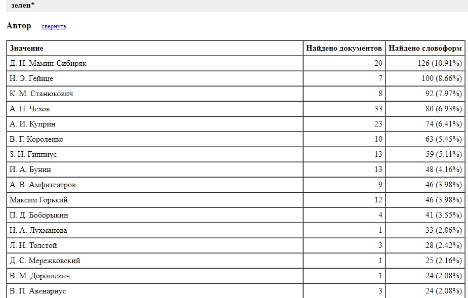
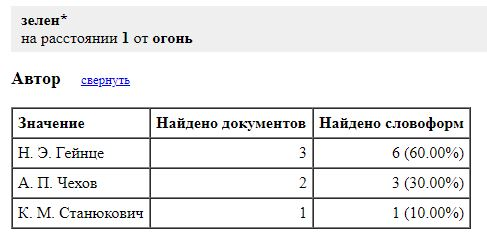

# Особенности цветовой поэтики в произведениях А. П. Чехова в 1890-1900 годах.

# Объект и предмет исследования

Исследовали мы корпус Чехова с 1890 по 1900. Собрали сами! Период выбрали потому, что в это время Чехов - состоявишийся автор с выработанным индивидуальным стилем. Искали слова и сочетания, имеющие семантику цвета.

# Гипотеза 

Какие гипотезы выдвигали: 1. Чехов - "цветной" автор. 2. Чехов будет использовать цветообозначения индивидуально, неожиданно. 3. Встретится достаточно много идиом, связанных с цветом.

# Методы

Какие средства использовали: mystem для лемматизирования корпуса, antconc для выявления наиболее частотных слов и конкордансов, НКРЯ: сопоставление чеховской цветовой поэтики с особенностями языка других писателей того же периода, построение графиков синонимов к "цветным" фразеологизмам.

# Часть 1. Они сошлись. Волна и камень, mystem и antconc, частотность и конкордансы.

* Наиболее частотными прилагательными цвета у Чехова оказались: белый, черный, красный, зелёный, серый, синий, голубой, розовый, золотой, желтый, багровый, рыжий.

* "Цветные" идиомы: белая кость, белый свет, белый день, чёрный взгляд, золотые руки, золотое время.

* Самые неожиданные конкордансы с прилагательным "зеленый": зелёный луч и зелёный огонь.

* Самые неожиданные конкордансы с прилагательным "желтый": желтая шея и желтая грудь; "коричневый": коричневая лысина.

* Также мы нашли несколько фамилий, в семантику которых входит цвет: Серебряков, Желтухин, Беликов.

# Часть 2. Colorful Chехов в контексте десятилетия

Для начала мы в НКРЯ составили тучу корпусов, например, корпус, включающий в себя всех писателей 1890-1900 годов, балующихся художественной литературой. 
Мы включили в поиск все цвета, которые только мог опознать НКРЯ, но при этом убрали из поиска всё, начинающееся на "тон", так как наш любимый сайт часто воспринимал тон=манера речи как цвет. 

Результат общего корпуса: 

VS 

Результат чеховского корпуса: 

Из не очень сложных подсчётов и незамысловатого сайта, подсчитывающего проценты автоматически, узнали, что доля чеховского цветного корпуса в общем не слишком велика, лишь каких-то 3.5%. Однако что касается современников Чехова в таком случае? Результаты вышли: 
Куприн aka самый цветастый парень на районе — 5%, Мамин-Сибиряк — 4%, Бунин — 1.3% и Андреев — меньше процента. Из этого выходит, что Чехов не в первых бы рядах бежал трубить в твиттер о месяце Гордости; Чехов явно не самый "цветастый" среди своих коллег.

Это также выражается в статистике НКРЯ, которая показывает, насколько часто Чехов и его современники используют цвета в целом. Напомним, чеховские любимые — чёрный, белый и зелёный.

Мы надеемся, что статистика вам сама всё пояснит (даём подсказку: прочтите последнее предложение второго абзаца этой части, чтобы найти ответ!): 

Однако это не умаляет достоинств нашего Любимого Писателя. Чехов, как мы проанализировали, великий изобретатель новых словосочетаний.
Как уже было упомянуто, Чехов использует такие выражения как коричневая лысина (сложно даже вообразить), зелёный луч, зелёный огонь, жёлтая грудь, жёлтая шея. Нам в свою очередь стало любопытно: а это Чехов с такой грандиозной силой воображения или это культурная фича?

Источник его вдохновения нам не ясен, но спешим вас заверить, что НКРЯ подобных словосочетаний у других писателей и впомине не знает.  
Пруфы:

Однако стоит оговориться насчёт зелёного огня. Как можно заметить из статистики ниже, Чехов не единственный, использующий странное "зелёный огонь" в своих художественных произведениях, однако это всё же не разрушает нашу теорию, что Чехов явно видит мир под иным цветным углом, чем все мы.

У Гэйнце "зелёный огонь" есть лишь в глазах, что, на наш взгляд, достаточно распространённый троп, который несёт в себе мало символической значимости. Станюкович же использует зелёный наряду с красным, чтобы нарисовать огонь в общем; "зелёный огонь" также часто проскакивает в нехудожественной литературе и обычно связан с военно-морской тематикой, на которой и завязан огонь Станюковича. 
Чехов же вкладывает в свой "зелёный огонь" такие смыслы, что хоть диссертацию пиши. 

*Чехов берёт не количеством, а качеством!*

# Часть 3. Цветастые фразеологизмы 

* Что касается всячески цветных фразеологизмов, Антон Палыч здесь не слишком оригинален. Несмотря на то, что среди более простых аналогов он всегда выбирает более яркие и метафорические конструкции, выбор его достаточно типичен: он использует наиболее распространенные фразеологизмы, на сей раз особой изобретательности не проявляя.

В числе них - *белый, как снег, красный, как рак, белый день, золотые руки, золотое время*. 
* Мы посмотрели частоту их использования в избранный нами промежуток:

* Так, мы видим, что в случае, например, с *"белым днем"* Чехов избирает не простое и самое популярное на тот момент **"при всех"**, а фразеологическое **"среди бела дня"**, а так же он скорее отдает дань старой традиции, используя вместо набирающего популярность прилагательного **"умелый"** оборот **"золотые руки"**, выходящий из употребления к концу 19 века.

*Так что в цветастых фразеологизмах Чехова - привычные всем тренды и традиции!*

